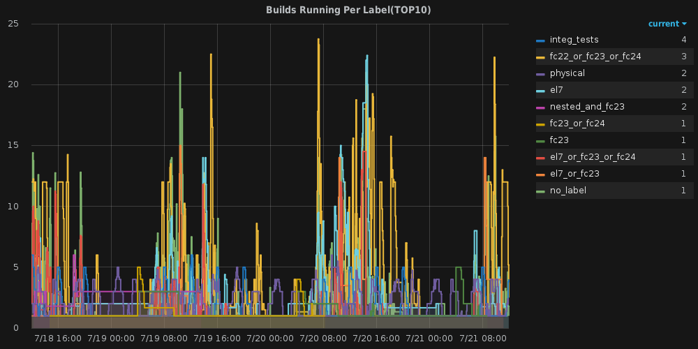
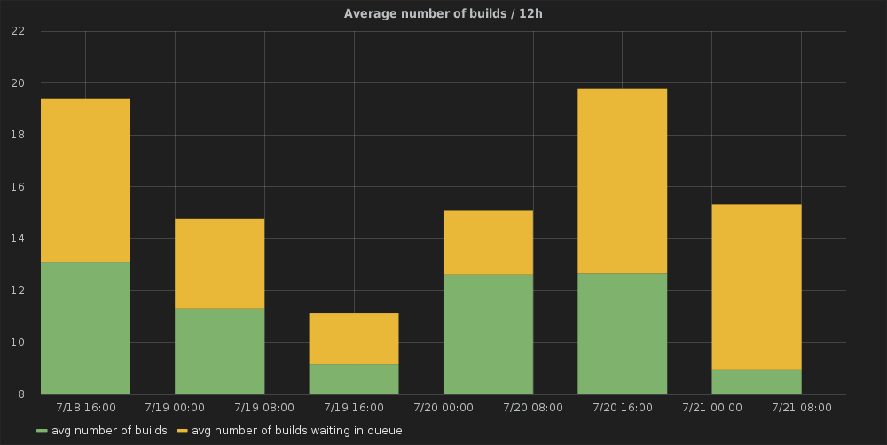
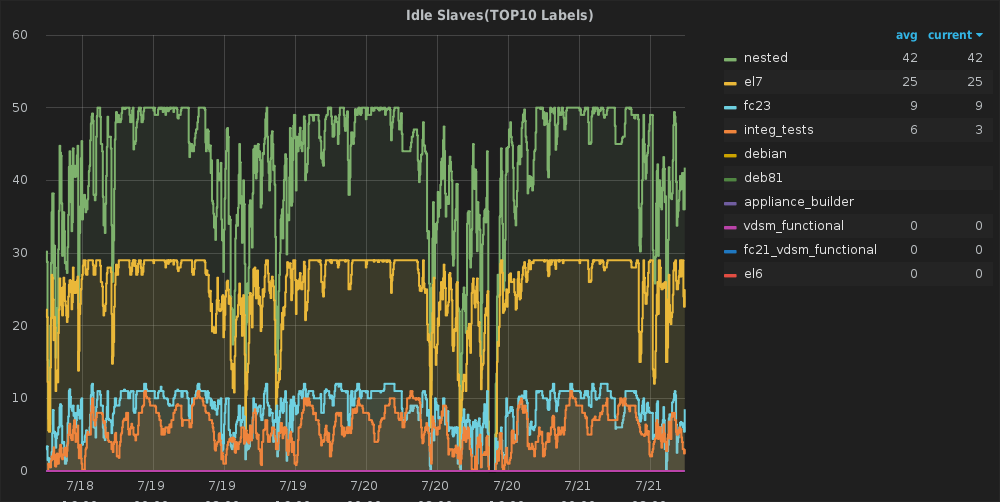
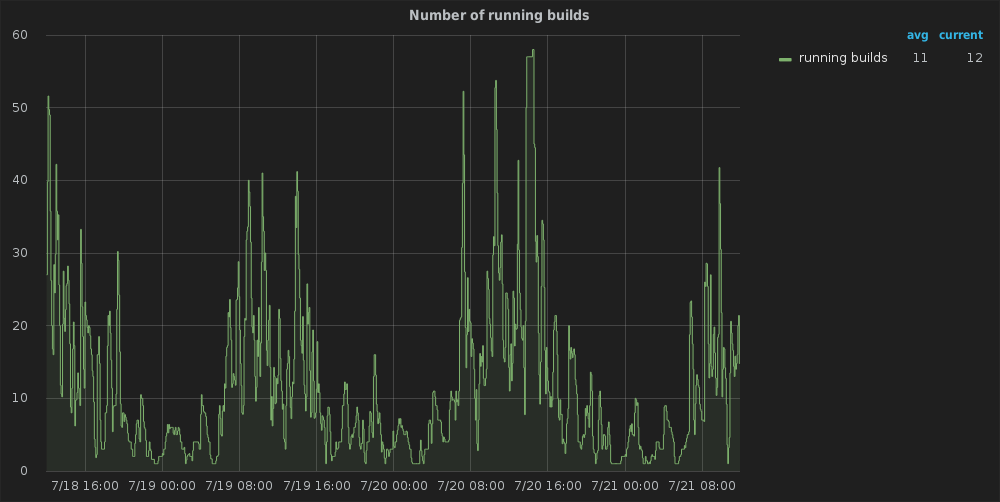
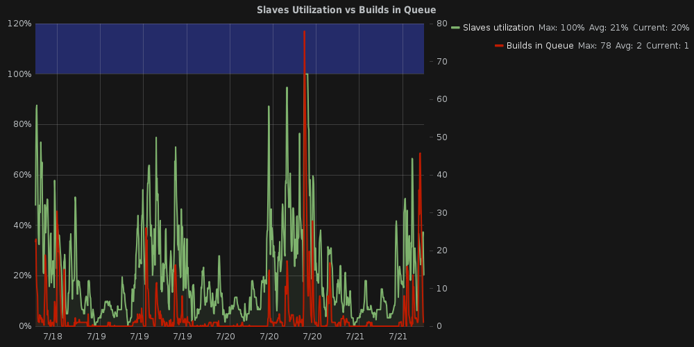

# Jenkins-graphite - Send Jenkins build stats to Graphite




Jenkins-graphite is a small script that pulls metrics from 
[Jenkins](https://jenkins.io/) and sends them to 
[Graphite](https://graphite.readthedocs.io/en/latest/), it uses the Jenkins CLI
to pull the metrics. The above graph was created using 
[Grafana](http://grafana.org/).

This was build for the [oVirt project](http://www.ovirt.org/).

# Requirments
```
Python 2.7
graphitesend==0.7.0
python_jenkins==0.4.11
xmltodict==0.9.2
backports.functools_lru_cache==1.2.1
jenkins==1.0.2
```

# Installation
1. Clone this repository: ``git clone http://github.com/nvgoldin/jenkins-graphite.git``
2. Create a Jenkins user with read rights to collect the metrics.

# Usage
- Run:
```shell 
python /path/to/clone/jenkins-graphite.py --jenkins_user <jenkins_user> \
	--jenkins_pass <jenkins_pass> \
	--jenkins_url http://jenkins.server.com \
	--graphite_host your.graphite.server.com \
	--interval 40 \
	--prefix jenkins \
	--log_file /path/to/clone/jenkins_graphite.log
```
This will run forever, pull metrics from Jenkins and send them to graphite 
every 40 seconds.
Currently, there is no daemon support, though you can just add '&' to
run it in the background.

- Command line arguments:
```shell
usage: jenkins_graphite.py [-h] --jenkins_url JENKINS_URL
                           [--graphite_host GRAPHITE_HOST]
                           [--jenkins_user JENKINS_USER]
                           [--jenkins_pass JENKINS_PASS] [--interval INTERVAL]
                           [--prefix PREFIX] [--cache_renew CACHE_RENEW]
                           [--log_file LOG_FILE]

optional arguments:
  -h, --help            show this help message and exit
  --jenkins_url JENKINS_URL
                        Jenkins url
  --graphite_host GRAPHITE_HOST
                        Graphite hostname
  --jenkins_user JENKINS_USER
                        Jenkins user
  --jenkins_pass JENKINS_PASS
                        Jenkins pass
  --interval INTERVAL   In what interval to collect stats
  --prefix PREFIX       Group name prefix for metrics sent to graphite
  --cache_renew CACHE_RENEW
                        after how many iterations to renew the cache,defaults
                        to estimated 24 hours
  --log_file LOG_FILE   where to write the logfile
```

# Which metrics are collected under what prefix:
- Number of running jobs per label:
	- systems.{fqdn}.{prefix}.builds.label.__labels extracted from job__.running
- Number of jobs in queue per label:	
	- systems.{fqdn}.{prefix}.inqueue.__labels extracted from job__.running
- Number of jobs in queue:
	- systems.{fqdn}.{prefix}.inqueue.total.running
- Number of builds running per job:
	- systems.{fqdn}.{prefix}.jobs.__job name__.running
- Number of online/idle slaves per label:
	- systems.{fqdn}.{prefix}.slaves.labels.__slave_label__.total
	- systems.{fqdn}.{prefix}.slaves.labels.__slave_label__.idle
- Total number of idle/online/total slaves:
	- systems.{fqdn}.{prefix}.slaves.totals.idle
	- systems.{fqdn}.{prefix}.slaves.totals.online
	- systems.{fqdn}.{prefix}.slaves.totals.total
- Internal stats, time until cache is flushed:
	- systems.{fqdn}.{prefix}.internal.cache.renew
- Internal stats, sampling interval(as specified by --cache--renew):
	- systems.{fqdn}.{prefix}.internal.sample.rate
- Internal stats, time it took to pull stats from jenkins and send to graphite
	- systems.{fqdn}.{prefix}.internal.sending.time
# Cache
The labels each job is restricted to are pulled by downloading the Job's .xml
file, as this is (relatively) an expensive operation, a cache is used, 
passing ``--cache_renew NUMBER`` will control how often the cache will be
flushed. If your labels change often, you can reduce it accordingly.


# Graph examples
These were generated using Grafana, if anyone wants I can
add the json template.

- Average number of builds:

- Builds running per label:

- Idle slaves:

- Running builds:

- Slave utilization vs Builds in Queue:

